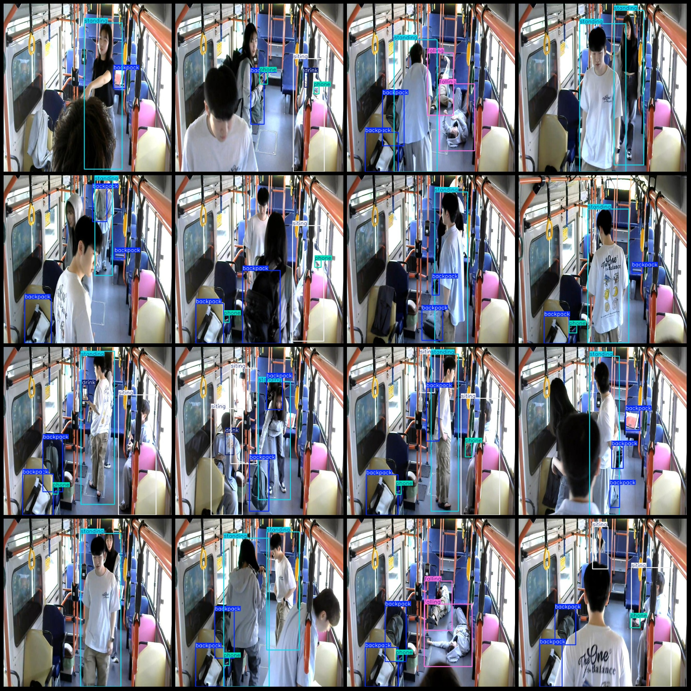
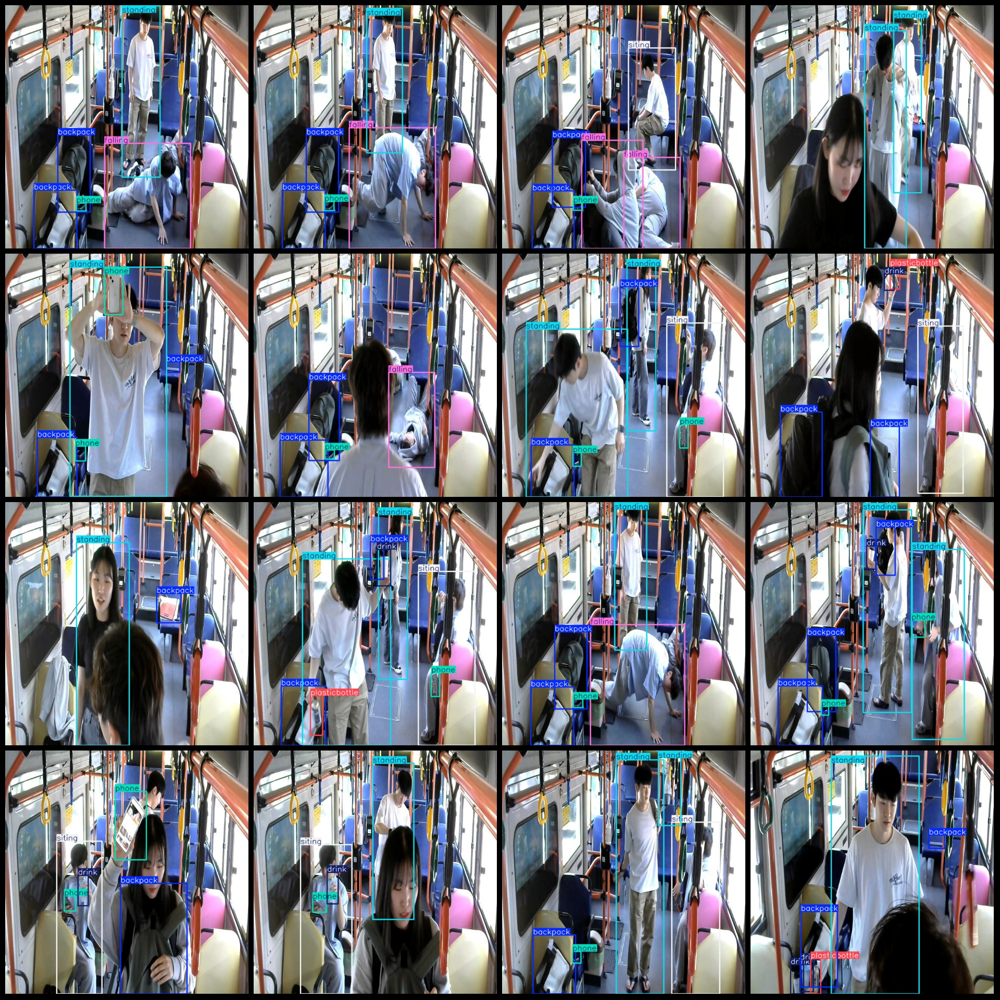

# Public Transport Vehicles and Passengers Pose Detection Dataset VOC+YOLO with 1326 Images in 8 Categories

Dataset format: Pascal VOC format + YOLO format (without split path) - txtfile, only containing jpg image and corresponding VOC format xmlfile and yolo format txtfile.
number of images: 1326  
annotation count: 1326  
annotation count: 1326  
annotationnumber of classes: 8  
Annotation class names: ["backpack", "drink", "falling", "phone", "plasticbottle", "siting", "smoke", "standing"]
boxes per class:   
The number of boxes in a backpack is 2441.
This is a rectangular box with 248 drinks.
falling box count = 503
The phone box count is 1086.
Plastic bottle, box count = 86
siting box count = 682
Smoke (smoky) box count = 8
The standing box count is 1384.
total boxes: 6438  
images per class:   
Backpack images = 1253
Drink images = 240
Falling images = 315
Phone images = 869
Plasticbottle images = 85
Sitting images = 493
Smoke images = 8
Standing images = 987
image resolution: 640x640  
Use annotation tool: labelImg
Annotation rules: draw a rectangle around the class.
Important notes: The dataset must not be divided into training, validation, and test sets. You need to do this yourself.
Special statement: This dataset does not guarantee any accuracy for the trained model or weight file.
Image preview:
## Images

Here is a pay link on Stripe ( https://buy.stripe.com/3cs8yP7sY87d0vu9AB ). Please contact me lonlonago@foxmail.com after funding $89, and I will send you a complete data files , thank you!

